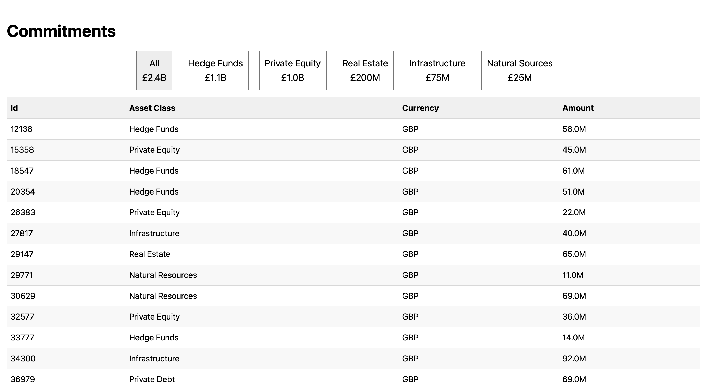

# Preqin Technical Interview

Hello! If you are reading this, then we're in the process of chatting with you about a technical role at Preqin. Congratulations!

To move forward, we'd like to know a bit about how you work. We'd like you to demonstrate your skills and abilities. Below is a user story that reflects with work you will be doing at Preqin day to day. We would like you to deliver an e2e functional prototype of the feature.

Try to limit yourself to around 3 hours, we would like to see how you find balance to get a working prototype.

You'll then showcase your work to some of our engineering team and discuss your solution, how you found balance to deliver a functional prototype and how you would do it diffrently on a production ready system.

This exercise is not graded or scored; it is designed to give us a sample of your thought processes as an engineer.

## The User Story

The aim is to fulfill the following user story:

```
As a Preqin user,
I want to see a list of investors, their details and the total of their commitments.
When I click on an investor,
I want to see a breakdown of their commitments.
When I click on an Asset Class
I want to see relevant commitments.
```

Sample data is provided in `data.csv`.

How you visualise the data is up to you, but we include some wireframes just in case you want some guidance:
 

Note: Assume a sole currency of GBP, and ignore any authentication needs.

## Technical Requirements

The solution is completely open but we would like you to think and show knowledge about these layers of a software system:

1. Data Layer: how to store the data.

2. Backend Services: how to provide data to consumers via a contractual API.

3. Web applications: how to consume and visualize data from API services on the web.

Notes:
- You are free to use any language and frameworks. 
- Out tech stack consists of: 
  - React micro frontends (newer ones with typescript, older ones without),
  - Python micro services (some using REST/FastAPI others using GQL/Strawberry), 
  - .NET (C#) for our legacy services,
  - Postgres and MSSQL databases
- It would be nice for you to demonstrate if you are skilled in any of these.
- `SQLite` is a quick an easy way to include a database as a file with your code.

## Submitting your solution

Please submit your solution by sharing a public github or bitbucket with your code with the recruiter.
We ask you do not fork or PR against the Preqin repository.

Thank you and good luck!
